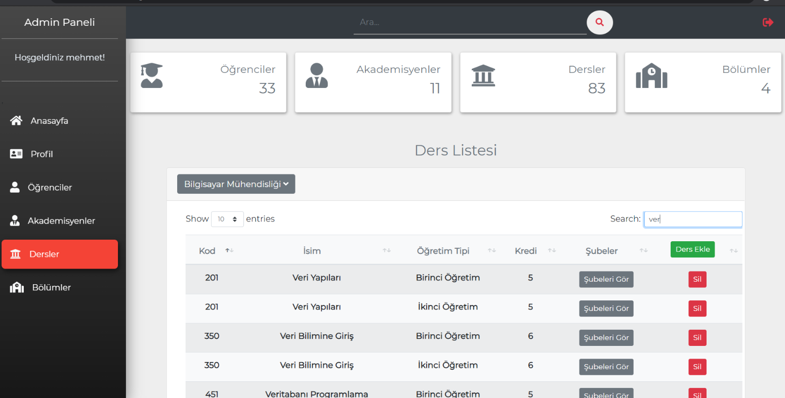
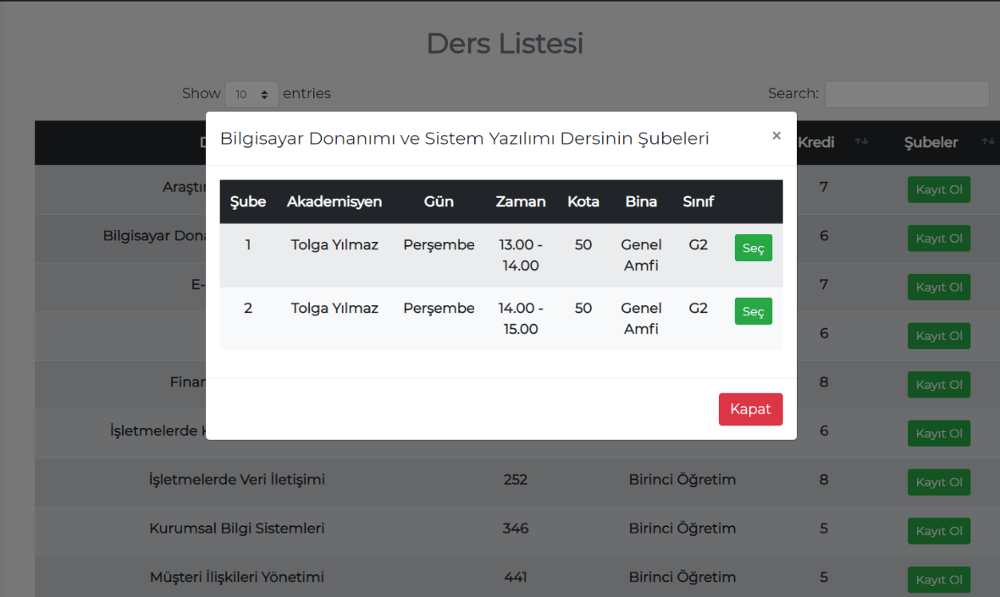
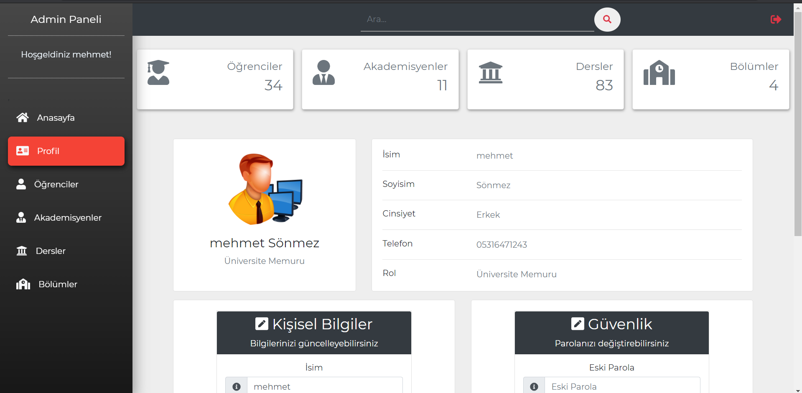
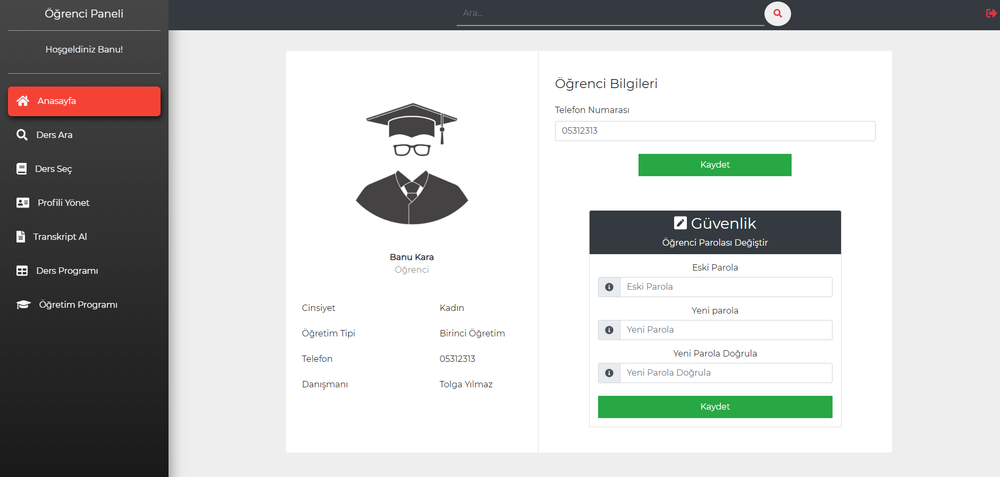
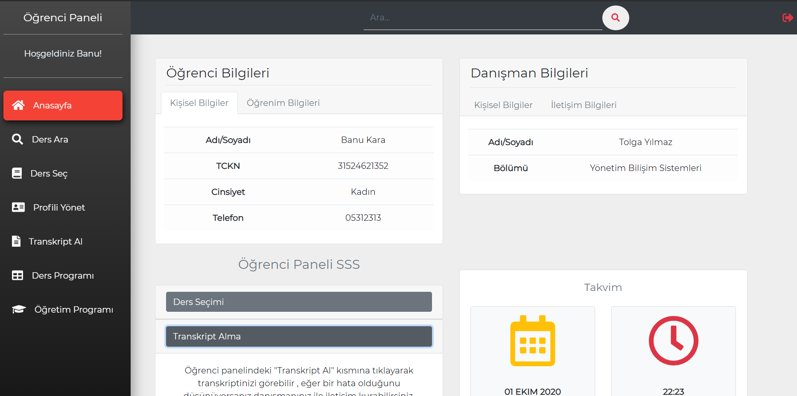
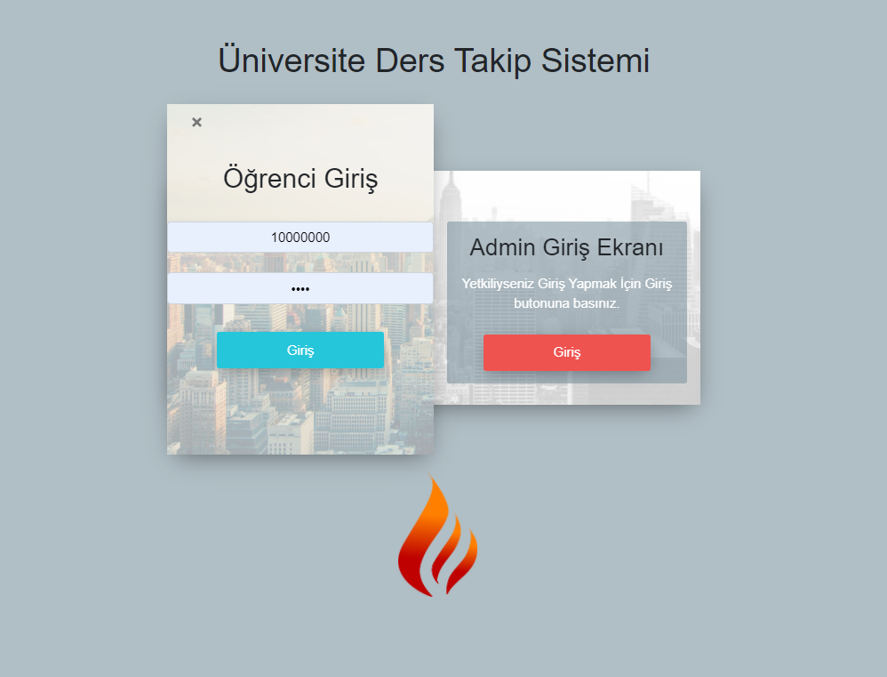

# StudentRegistrationSystem

A student course registration system with both admin and student modules powered by ASP.NET MVC and runs on AZURE SQL (SQL Server Engine) database within the context of Ford Otosan internship.

Some of the views from the project can be observed below.

# Admin Dertment-Lectures View

# Course Seletion View

# Section Seletion View

# Admin Profile  View

# Student Profile View

# Student HomePage View

# Login  View

